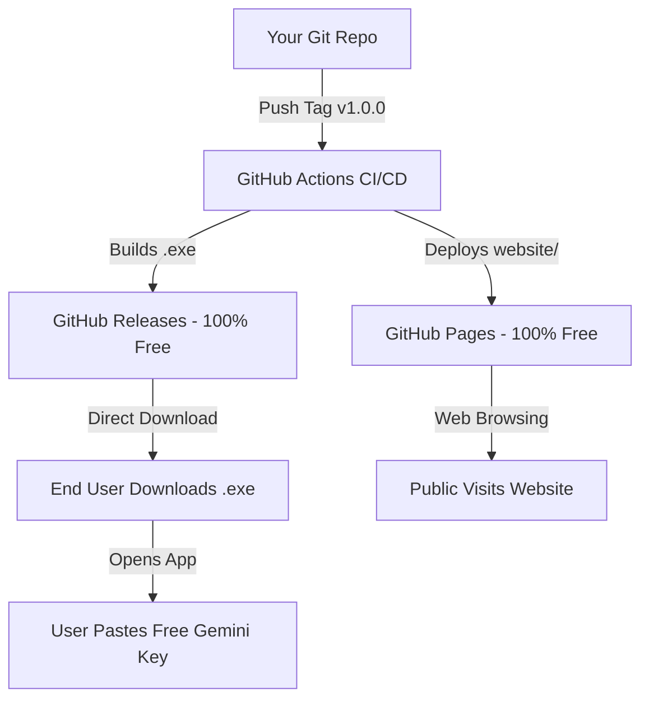

# INTENT: Complete Deployment, Hosting & Distribution Guide

This document explains how to run **INTENT** and its website locally right now on `localhost`, and how to publish both the application (`.exe` installer) and the landing page to the public for **100% free with zero hosting costs**.

---

## 1. Localhost Execution (Run Everything Right Now)

### A. Run the INTENT Desktop Application on Localhost
```powershell
# Start Electron app in development mode
npm run dev
```
- The floating intent bar appears on your desktop.
- Press `Alt + Space` to toggle the assistant panel.
- Click `[KEY ⚙]` in the top bar to paste your Google Gemini API key and test the connection.

### B. Run the Website Landing Page on Localhost
```powershell
# Serve website on http://localhost:3000
npm run website

# Or launch browser automatically:
npm run website:open
```
- Open `http://localhost:3000` in your browser.
- Interactive terminal simulations, feature tables, download links, and developer support tiers are live.

---

## 2. Packaging the Windows `.exe` Installer Locally

To generate the standalone `INTENT Setup 1.0.0.exe` installer on your machine:

```powershell
# Compile production bundle and generate Windows NSIS installer
npm run package
```

The output file will be generated in:
```
release/INTENT Setup 1.0.0.exe
```

This installer can be shared directly with any Windows user or uploaded to cloud storage / GitHub.

---

## 3. Easiest & 100% Free Hosting Architecture

To make the application and website available to the public without paying for servers:



### Step 1: Host the `.exe` Installer on GitHub Releases (Free Unlimited Bandwidth)
1. Push your repository to GitHub: `https://github.com/<your-username>/INTENT`.
2. Create and push a version tag:
   ```powershell
   git tag v1.0.0
   git push origin v1.0.0
   ```
3. The included GitHub Actions workflow (`.github/workflows/release-and-deploy.yml`) will automatically:
   - Compile the Windows `.exe` installer.
   - Attach `INTENT Setup 1.0.0.exe` to a new release at `https://github.com/<your-username>/INTENT/releases/latest`.
   - Provide a direct permanent download link:
     ```
     https://github.com/<your-username>/INTENT/releases/latest/download/INTENT-Setup-1.0.0.exe
     ```

### Step 2: Host the Website on GitHub Pages (100% Free)
1. In your GitHub repository, go to **Settings** → **Pages**.
2. Under **Build and deployment** → **Source**, select **GitHub Actions**.
3. Every time you push to `main` or push a tag, the workflow automatically deploys `website/` to:
   ```
   https://<your-username>.github.io/INTENT/
   ```
4. (Optional) You can link a custom domain (e.g. `intent-ai.com`) for free in repository settings.

### Alternative Free Website Hosting (Vercel / Cloudflare Pages)
- **Vercel**: Import your GitHub repo, set Root Directory to `website`, click Deploy (100% free with instant CDN).
- **Cloudflare Pages**: Connect repo, set output directory to `website`, deploy with free DDoS protection.

---

## 4. "Bring Your Own Key" (BYOK) User Flow

When public users install INTENT:
1. Users launch `INTENT` from their desktop or start menu.
2. The **First-Run Setup Wizard** guides them to step 1:
   - Prompts for a free Google Gemini API Key.
   - Provides a one-click link to [Google AI Studio](https://aistudio.google.com/app/apikey).
3. The user creates a free key (15 requests/minute, no credit card required) and pastes it into INTENT.
4. INTENT verifies the key and saves it locally in `%APPDATA%\intent-desktop\intent_config.json`.
5. Users can update, test, or clear their key anytime by clicking `[KEY ⚙]` in the top header.

---

## 5. Developer AI Credits & Support Payments

Both the desktop app and the landing page include non-intrusive support sections:

### Configurable Tiers
- **$3.00 — Coffee Boost**: Day-to-day open source maintenance.
- **$10.00 — AI Compute Credits**: Multi-modal vision benchmarking & prompt datasets.
- **$25.00 — Core Project Sponsor**: Feature prioritization and priority support.

### Customizing Payment Links
Edit payment URLs in:
1. **Desktop App**: `src/components/SupportModal.tsx` (`SUPPORT_URLS.buymeacoffee`, `github`, `kofi`)
2. **Landing Page**: `website/index.html` (under `#support` section)

Supported platforms:
- **Buy Me a Coffee**: `https://buymeacoffee.com/<your-handle>`
- **GitHub Sponsors**: `https://github.com/sponsors/<your-handle>`
- **Ko-fi**: `https://ko-fi.com/<your-handle>`
- **Stripe Payment Link / PayPal / UPI**

---

## Summary of Commands

| Action | Command |
|---|---|
| Run Desktop App Locally | `npm run dev` |
| Run Website on Localhost | `npm run website` |
| Build Windows `.exe` Installer | `npm run package` |
| Check Python Automation Helper | `npm run diagnose` |
| Run Automated Self-Tests | `npm run intent:self-test` |
